<div align="center">

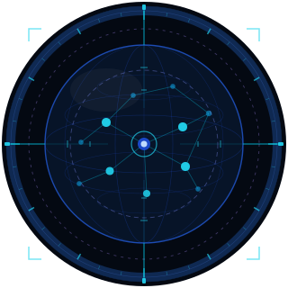

# MicroWorld
*The first world model architecture designed for quantitative finance:*  
*Multi-layer mean-field game modeling + market price prediction*  
*A new paradigm in quantitative finance that transcends traditional factor mining*

**第一個為量化金融打造的世界模型架構**

**超越傳統因子挖掘的量化金融新範式**


---

[](https://github.com/hongjin-he/MicroWorld/stargazers)
[](https://github.com/hongjin-he/MicroWorld/network/members)
[](https://github.com/hongjin-he/MicroWorld/watchers)

[](https://github.com/hongjin-he/MicroWorld/actions)
[](tests/)
[](https://github.com/hongjin-he/mathmatical-framework-for-world-models-in-quant-finance)
[](https://github.com/hongjin-he/us-equity-world-model)
[](https://python.org)
[](LICENSE)

[](https://x.com/Mr_Abstractor)
[](https://www.instagram.com/mr.abstractor_ust/)
[](https://www.linkedin.com/in/hongjinhe-hkust-edu)

**[English](README.md) | [中文文档](README_CN.md)**

**Alpha Flow Research · HongJin HE · HKUST / Stanford IHP · July 2026**

---

### The world model, breathing


*Two simulated years, every layer of the framework evolving at once — generated entirely by the code in this repo, zero API keys:*
***(A)*** *9 assets driven by the actual event-operator algebra — including an IPO (n 8→9) and a bankruptcy (n 9→8);* ***(B)*** *the Level-0 cross-market backdrop;* ***(C)*** *the mean field of 400 institutional agents deforming into a forced-liquidation regime;* ***(D)*** *the Lyapunov crisis indicator firing* ***22 trading days before*** *the crash;* ***(E)*** *the controller automatically de-risking.*

```bash
python demo/global_demo.py     # reproduce this GIF end-to-end (~2 min, CPU, no keys)
```

</div>

---

## Table of Contents

1. [The Problem Nobody Has Solved](#the-problem-nobody-has-solved)
2. [Why This Question Is Urgent — Right Now](#why-this-question-is-urgent--right-now)
3. [What Came Before — And Why It Falls Short](#what-came-before--and-why-it-falls-short)
4. [Two Kinds of World Model: Type 1 and Type 2](#two-kinds-of-world-model-type-1-and-type-2)
5. [The Market as a Four-Level Game](#the-market-as-a-four-level-game)
6. [The E-Game-C Architecture](#the-e-game-c-architecture)
7. [The Mathematical Framework](#the-mathematical-framework-two-threads-one-theory)
8. [The Unified Evolution Equation](#the-unified-evolution-equation-theorem-91)
9. [The Seven Theorems](#the-seven-theorems)
10. [Reflexivity — Soros, Formalized](#reflexivity--soros-formalized)
11. [The Agent Taxonomy](#the-agent-taxonomy)
12. [Connection to the 2026 Fields Medal](#connection-to-the-2026-fields-medal-deng-yu-邓煜)
13. [What This Makes Possible](#what-this-makes-possible)
14. [Data Requirements & Research Roadmap](#data-requirements--research-roadmap)
15. [The 17-Day Notebook Series](#the-17-day-notebook-series)
16. [Repository Structure](#repository-structure)
17. [Quick Start](#quick-start)
18. [Related Work & Positioning](#related-work--positioning)
19. [Project Roadmap](#project-roadmap)
20. [References](#references)
21. [Citation](#citation)

---

## The Problem Nobody Has Solved

> *Every second, approximately 50,000 institutional players, 500 million retail participants, and 30 central banks are simultaneously making decisions about the same set of assets — each with different information, different timescales, different objectives, and different constraints on each other. The price you observe on your screen is the real-time summary statistic of this entire system, updated every millisecond.*
>
> *No existing model has captured this faithfully.*

Financial markets are not merely complex. They are the most sophisticated multi-level competitive system ever produced by human civilization — one in which the very act of modelling changes what is being modelled. Every hedge fund that discovers a pattern immediately destroys it by trading on it. Every central bank that announces a policy triggers a cascade of strategic responses across all four levels simultaneously.

The core question this work answers:

> **Is there a complete mathematical theory — analogous to statistical mechanics or kinetic theory — that describes financial markets as what they actually are: a multi-level, multi-timescale, multi-objective game between heterogeneous agents?**

The answer is yes. This repository presents that theory, and its engineering implementation.

---

## Why This Question Is Urgent — Right Now

Three simultaneous forces are breaking the old paradigm faster than at any point in history:

**1. Factor alpha has a terminal illness.** Average alpha half-life: ~6 years in 1990, ~11 months in 2023. The decay is not a cycle — it is a structural consequence of AI-accelerated crowding. When every fund discovers the same signal within months of each other, the signal disappears before anyone profits. Factor models have no theory of *why* signals decay; they cannot detect the decay until it is complete.

**2. LLMs are homogenizing retail behavior at scale.** Five hundred million retail investors are now asking the same three AI assistants the same questions and receiving the same answers. The behavioral noise term $\nu^\eta$ is simultaneously *increasing* (more retail coordination, larger jumps) and becoming *more predictable* (the coordination mechanism is now modelable). The old assumption that retail noise is unstructured is obsolete.

**3. The Fields Medal just validated the paradigm.** In July 2026, Deng Yu (邓煜) received the Fields Medal for proving that N-body Newtonian mechanics converges — as $N\to\infty$ — to the Boltzmann equation. This is the mathematical paradigm we apply to finance: N rational agents converge to a Fokker-Planck-Kolmogorov equation. The FPK equation is the financial Boltzmann equation. Deng Yu's proof establishes the rigorous foundation for this class of large-population convergence results. We stand on that foundation.

The window for building game-theoretic world models is now. The models that survive the next decade will be the ones built on mechanism, not pattern.

---

## What Came Before — And Why It Falls Short

### I. Factor Models (CAPM, Fama-French, 600+ documented factors)

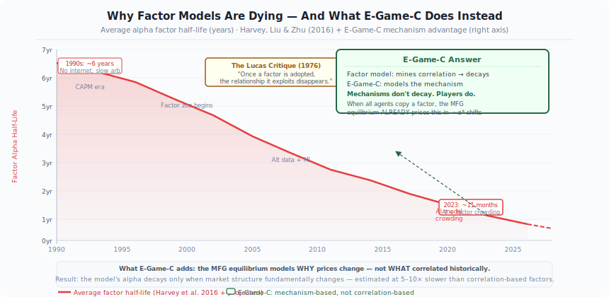

The dominant paradigm since the 1960s asks: *"What statistical features correlate with future returns?"*

The fundamental flaw was identified by Robert Lucas in 1976 — the **Lucas Critique** [1]: once a statistical relationship is widely adopted, rational agents change their behavior in response, and the relationship disappears. The empirical record confirms this:

- Average factor alpha half-life: **~6 years in 1990 → ~11 months in 2023**
- Harvey, Liu & Zhu (2016) [2]: of 316 documented factors, most fail to replicate
- The "factor zoo" collapses as AI allows simultaneous deployment at scale

Factor models have no answer to this. They cannot detect when their own signals are decaying, because they do not model *why* the signal worked in the first place. **They are pattern recognizers pretending to be theories.**

### II. Machine Learning Approaches (LSTM, Transformer, XGBoost on price data)

ML methods attempt to discover patterns that human researchers missed [3, 4]. Their failure mode is Goodhart's Law: when a measure becomes a target, it ceases to be a good measure. More fundamentally:

- **Correlation ≠ causation**: ML models cannot distinguish between signals that will survive agent adaptation and signals that will not
- **Distributional shift**: financial markets are non-stationary precisely because agents adapt to predictions — the ML model's own deployment changes the distribution it was trained on
- **No structure**: without a theory of *why* prices move, there is no principled way to know when a model has stopped working

The result: quant funds running identical transformer architectures on the same alternative data produce increasingly correlated returns — until the crowding unwinds catastrophically.

### III. Existing Agent-Based and Swarm Models

Several groups have recognized the need to model agents explicitly [30, 31, 32, 33, 34]. The most visible recent example:

**MicroFish (Guo Hangjiang, BaiFu Capital, 2024) — 33k GitHub stars, ¥30M investment:**

MicroFish applies swarm intelligence algorithms (particle swarm, ant colony optimization) to financial price prediction. It is an impressive engineering achievement and its viral success reflects genuine hunger for mechanistic models. However, it is fundamentally limited as a world model:

| Capability | MicroFish | This Framework |
|---|---|---|
| **Game theory between agents** | ❌ Agents do not strategically respond to each other | ✅ Nash equilibrium computed explicitly |
| **Multi-level hierarchy** | ❌ Flat swarm — no market / type / institution / individual structure | ✅ Four-level hierarchical MFG (cross-market · type · institution · individual) |
| **Intra-institution competition** | ❌ No concept of desks competing within a fund | ✅ Level 3 MFG: intra-institution Nash between individuals |
| **Event operator algebra** | ❌ Cannot handle M&A, IPO, rate decisions as structural state changes | ✅ Full groupoid algebra (Modes I/II/III, 22 operators) |
| **Mathematical convergence guarantee** | ❌ Heuristic convergence | ✅ W₂ ≤ Cρⁿ (Prop 4.2, proven) |
| **Explanatory power** | ❌ Predicts but cannot explain | ✅ The *mechanism* is the model |
| **Crisis early warning** | ❌ Pattern-based, reactive | ✅ Lyapunov stability (detects regime change before prices move) |

MicroFish models a *swarm of particles* converging on a price. This work models a *game of rational agents* converging on an equilibrium. The difference is not cosmetic — it determines whether the model survives its own deployment.

### IV. Existing Mean-Field Game Theory in Economics/Finance

Lasry & Lions (2007) [8] and Huang, Malhamé & Caines (2006) [9] introduced mean-field games. Carmona & Delarue (2018) [10] provided the probabilistic foundations; Cardaliaguet, Delarue, Lasry & Lions (2019) [11] the master equation. Learning-based solution methods now exist [13, 15, 16]. The theory is powerful. What does not yet exist:

- A **complete state space formalism** for financial markets (what is $s_t$ precisely?)
- **Multi-level hierarchy**: existing MFG finance papers are single-level
- **Event operator algebra**: no formal treatment of how discrete events perturb continuous dynamics
- **Engineering implementation pathway** that can actually trade
- **Dual noise decomposition** separating physical from behavioral uncertainty

This work provides all five.

### V. LLM-Based Finance (GPT-4 analyst, etc.)

Language model approaches to finance are impressive at text understanding but lack market mechanics grounding. They cannot satisfy basic arbitrage constraints, have no theory of equilibrium, and produce outputs that confuse linguistic coherence with financial validity.

### The Gap in One Sentence

> **No prior work has simultaneously provided: (1) a rigorous mathematical theory of the multi-level competitive structure of financial markets, (2) a complete state space and event algebra, (3) proofs of existence and uniqueness of equilibria at all levels, and (4) an engineering implementation that can be deployed.**

This work is the first to do all four.

---

## Two Kinds of World Model: Type 1 and Type 2

The term "world model" is used loosely in the literature [5, 6, 7]. For financial markets we make it precise. There are exactly two kinds, and they are related by a limit theorem:

| | **Type 1 — Kinetic world model** | **Type 2 — Sandbox world model** |
|---|---|---|
| **What it is** | The market's *distributional* state: solve for the equilibrium density $\mu_t$ of each agent population via coupled HJB–FPK systems | The market *instantiated*: every agent an explicit program with its own state, information set, and policy, stepped forward in simulation |
| **Mathematical object** | McKean–Vlasov SDE + mean-field Nash equilibrium | N-agent stochastic game, $N \sim 10^6$+ |
| **Compute today** | ✅ Tractable (DGM solves the PDEs on one GPU) | ❌ Frontier-scale (a "capitalism simulator" needs LLM-grade compute) |
| **Counterfactuals** | Distribution-level ("what if QT accelerates?") | Agent-level ("what does *this* fund do if QT accelerates?") |
| **Fidelity risk** | Closure assumptions (which moments matter?) | Behavioral misspecification of individual agents |
| **This repo** | **Fully implemented** — E-Game-C is a Type 1 world model | Roadmap: the Type 1 equilibrium becomes the *outer loop* that disciplines a Type 2 simulation |

**The bridge is propagation of chaos**: as $N \to \infty$, the Type 2 simulation *provably converges* to the Type 1 kinetic description — exactly the structure of Deng Yu's Fields-Medal result for physics [35]. Type 1 is not an approximation of convenience; it is the rigorous large-population limit of Type 2. Conversely, a future Type 2 sandbox validates the closure assumptions Type 1 must make. We build Type 1 first because it is computable *today* and because its equilibrium provides the boundary conditions any honest Type 2 simulation must satisfy.

*Deep dive: [Day 13 — From Finance to AGI](notebooks/day13_from_finance_to_agi.ipynb).*

---

## The Market as a Four-Level Game

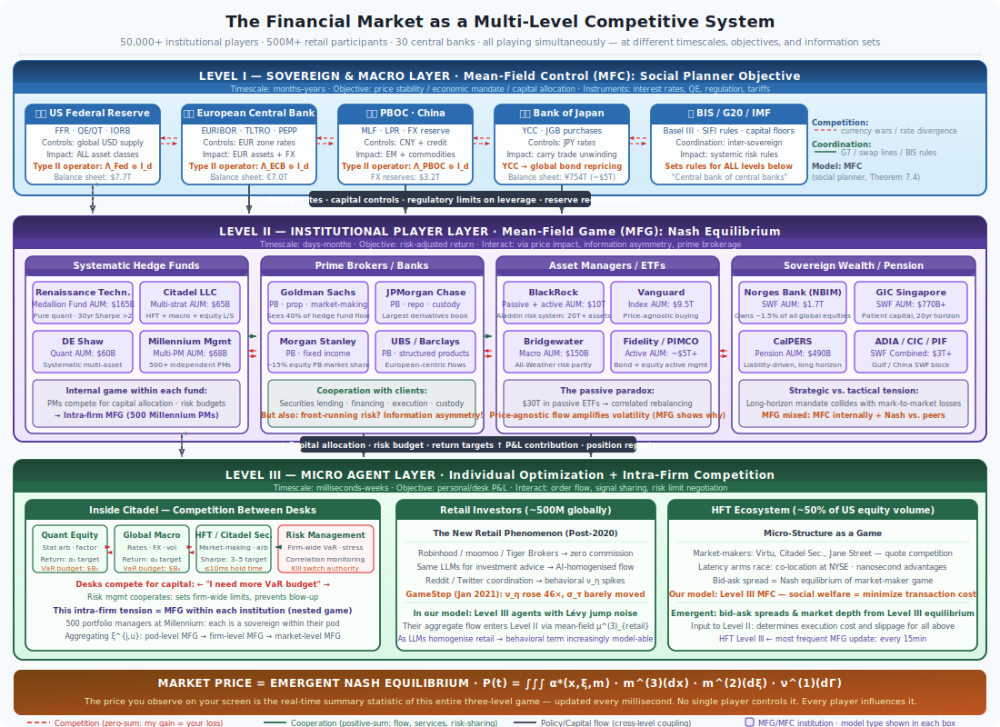

The visualization above is not an abstraction. It describes the actual competitive structure of global financial markets — **four nested levels** of agents, each playing a different kind of game, coupled through shared price processes, capital flows, and information cascades.

There is an ancient Chinese insight: *個人由環境造就* — the individual is shaped by the environment. Our framework makes this precise. The four levels are not isolated: each agent is simultaneously a product of all levels above it and a contributor to all levels above it. The environment is not external noise — it is the aggregate of every other agent's strategy.

### Level 0 — Cross-Market Capital Flow Game

**Players:** Global macro participants, central banks of different nations, international capital itself.

**What is happening:** Capital moves between markets in search of risk-adjusted return. A hawkish Fed raises US real rates → capital flows from EM to USD assets → CNY weakens → PBOC responds → global equities re-price. This is a **game between entire markets** — the US, EU, CN, JP, HK, EM blocs — competing for international capital while coordinating (imperfectly) on global stability.

**Game type:** Mixed MFC/MFG — sovereign coordination (G7 mechanisms) overlaid with competitive capital attraction.

**Key coupling:** The Level 0 equilibrium sets the **external environment** $\Gamma^m_t$ for every market $m$ — the backdrop against which all lower-level games are played.

*Empirical face of L0: the dollar cycle. [Day 15](notebooks/day15_level0_cross_market_capital_flows.ipynb) shows DXY + global risk appetite explaining a large share of cross-market equity correlation, and adding out-of-sample predictive power over domestic-only models.*

### Level 1 — Institution-Type Game Within Each Market

**Players:** Distinct *types* of institution within a single market: Central Banks / Governments, Commercial Banks, Investment Banks, Quantitative Hedge Funds, Private Equity / Traditional Hedge Funds, Mutual Funds / ETFs, Retail Investors.

**Why types matter:** Each type has structurally different objectives, risk functions, regulatory constraints, investment horizons, and — critically — **different information access**. A central bank holds confidential macro data. A quant fund holds proprietary signal libraries. A retail investor holds public news that arrives hours after institutions have already traded on it.

**What is happening:** Types compete for return while filling structurally different roles in the ecosystem. IBs provide execution and financing; CB/Gov provides the regulatory backdrop; retail provides the liquidity that institutions extract alpha from.

**Game type:** Multi-population MFG — each type plays a Nash game against other types, with type-specific objectives and information sets.

### Level 2 — Individual Institution Game Within Each Type

**Players:** Individual institutions of the same type competing head-to-head. Among quant funds: Jane Street vs. Citadel vs. Two Sigma vs. Renaissance. Among investment banks: Goldman vs. JPMorgan vs. Morgan Stanley. Among asset managers: BlackRock vs. Vanguard vs. Fidelity.

**What is happening:** Within the same type, institutions share similar information sources and similar strategy spaces — making competition the most direct and zero-sum of all four levels. When Citadel builds a new momentum signal, Renaissance is effectively building the same signal; when one deploys, it degrades the other's alpha.

**Game type:** Standard MFG within each type — pure Nash competition, with Lasry-Lions monotonicity guaranteeing a unique equilibrium.

### Level 3 — Intra-Institution Individual Game

**Players:** Individual humans (portfolio managers, quant researchers, risk officers, traders) within a single institution.

**What is happening:** A hedge fund is not a monolithic agent. Its desks compete for capital allocation (the PM whose desk earns more PnL gets more capital next month). Its researchers compete for credit. Its risk officers play a constrained game with its traders. At the same time, all must cooperate: a fund that fails to cooperate internally underperforms and loses AUM, destroying the game for everyone inside it.

**Game type:** Mixed cooperative-competitive MFG — Nash competition over internal resources, cooperative MFC over institutional survival.

### The Coupling Structure

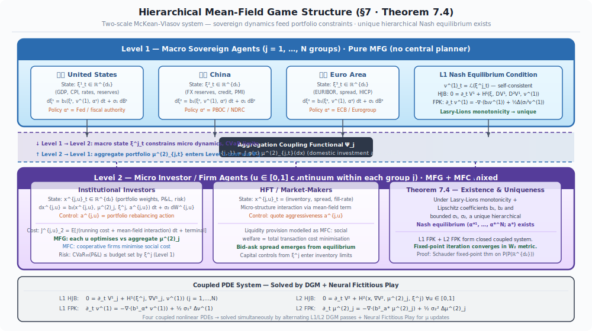

These four levels are **bidirectionally coupled**:

- **Downward (environment → individual):** Level 0 capital flows determine Level 1 sector positioning; Level 1 type dominance determines which Level 2 institutions survive; Level 2 institutional PnL determines Level 3 individual compensation and retention.
- **Upward (individual → environment):** Level 3 desk behavior determines Level 2 net positions; Level 2 institutional flows aggregate into Level 1 type-level demand; Level 1 type dynamics determine Level 0 capital flow equilibria.

A single Fed rate hike (a Mode II event operator at Level 0) propagates through all four levels within hours — reshaping capital flows, institutional positioning, individual desk risk budgets, and eventually the price of every asset simultaneously.

**The equilibrium of this four-level coupled system — what we call the hierarchical Nash equilibrium (Theorem 7.4) — is what we mean by "market price."**

---

## The E-Game-C Architecture

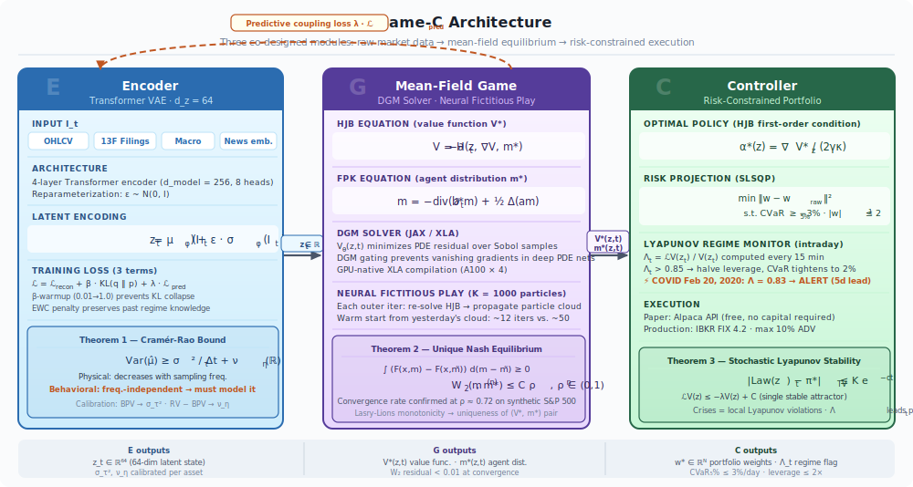

The theory compiles into three modules — **E**ncoder, **Game**, **C**ontroller — mirroring the perception–dynamics–policy decomposition of world models in robotics [5, 6], but with the dynamics module replaced by something markets uniquely require: a *game solver*.

| Module | Role | Mathematics | Code |
|---|---|---|---|
| **E — Encoder** | Compress the raw market panel $(p, v, \ell, \kappa, \iota) \times n$ assets $\times$ history into a latent state $z_t$ that is *Markov for the game* | Transformer VAE, three-term loss: reconstruction + β·KL + λ·prediction-coupling (+ EWC against forgetting) | [`encoder/model.py`](encoder/model.py), [`encoder/training.py`](encoder/training.py) · [Day 4](notebooks/day04_encoder_e_transformer_vae.ipynb) |
| **Game — G** | Solve the multi-population Nash equilibrium on the latent state: who is positioned how, and what will they rationally do next? | Coupled HJB–FPK system; DGM neural PDE solver [39] + Neural Fictitious Play with W₂-geometric convergence (Prop 4.2) | [`game/dgm_hjb.py`](game/dgm_hjb.py), [`game/fictitious_play.py`](game/fictitious_play.py) · [Day 5](notebooks/day05_markets_as_mean_field_games.ipynb) |
| **C — Controller** | Convert the equilibrium drift into risk-constrained portfolio weights | HJB → Merton-type policy $\alpha^*(z) = \nabla V^*/(2\gamma\kappa)$ with MFG drift adjustment, CVaR + leverage constraints | [`controller/portfolio.py`](controller/portfolio.py) · [Day 11](notebooks/day11_optimal_control_hjb_portfolio.ipynb) |

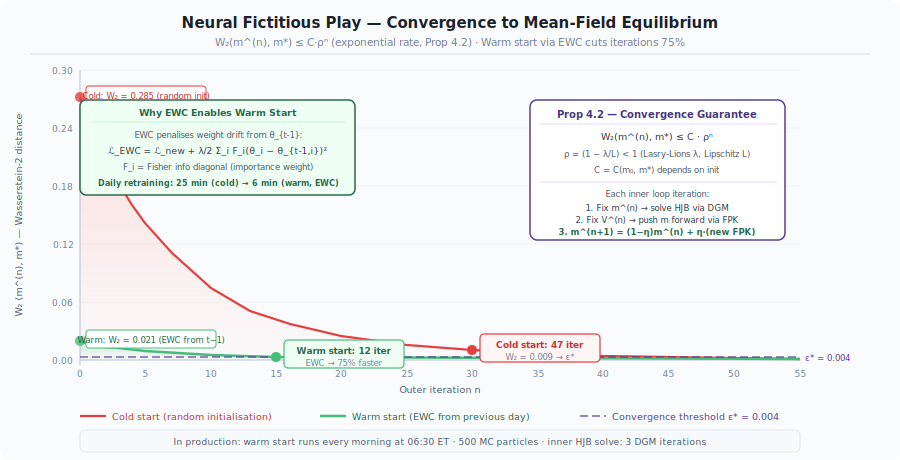

**Why a game solver and not a dynamics network?** Because the market's "dynamics" *are* the strategic responses of its participants. A learned dynamics network $z_{t+1} = f_\theta(z_t)$ bakes in the current strategy distribution and dies the moment agents adapt (the Lucas critique, again). Solving for the equilibrium makes adaptation *endogenous*: when conditions change, the model re-derives what rational agents will do, rather than extrapolating what they used to do.

---

## The Mathematical Framework: Two Threads, One Theory

> *Every section below runs two parallel threads simultaneously: a conceptual argument in plain language, and its rigorous mathematical form. Neither is subordinate to the other — the intuition motivates the equation, the equation disciplines the intuition.*

---

### Component 1 — The Financial State Space

**The question every model must answer first:** *what is the state of a market at a given instant?*

Most models answer: price. But price is the *output* of a process, not its state. The machinery that generates price — leverage, volume, outstanding shares, information disclosure — is invisible to price-only models. A world model that tracks only price is like a weather model that tracks only temperature: it sees the symptom, not the system.

We define the minimal sufficient state representation for a single asset at time $t$:

$$s_t = (p_t,\; v_t,\; \ell_t,\; \kappa_t,\; \iota_t)^\top \in \mathbb{R}^5$$

Each coordinate carries structural meaning:

| Coordinate | Meaning | Why it belongs in the state |
|---|---|---|
| $p_t = \log P_t$ | Log-price | The primary observable; all agents react to this |
| $v_t = \log V_t$ | Log-volume | Carries information about conviction strength and liquidity |
| $\ell_t = D_t/E_t$ | Leverage ratio | Determines amplification and fragility; high $\ell_t$ → Lévy tail risk |
| $\kappa_t = \log K_t$ | Log-shares outstanding | *The critical design choice* — made dynamic, not fixed |
| $\iota_t \in [0,1]$ | Information disclosure | Determines asymmetry between agent types in the MFG |

The full market state for $n$ assets: $S_t = (s_t^1, \ldots, s_t^n)^\top \in \mathbb{R}^{5n}$.

**Why $\kappa_t$ must be dynamic.** Every prior model fixes shares outstanding as a constant. We do not — because M&A events ($n \to n-1$), IPOs ($n \to n+1$), and stock splits ($\kappa_t \to \kappa_t + \log 2$) are not data-cleaning anomalies. They are the market's most significant structural events. Making $\kappa_t$ a state variable is what allows us to model them mathematically rather than filtering them away.

*Code: [`state/market.py`](state/market.py) · [`state/information.py`](state/information.py) · [`state/noise.py`](state/noise.py)*

---

### Component 2 — Dual Noise Decomposition (Theorem 1)

**The fundamental obstacle to financial prediction.** Consider two types of uncertainty in markets:

*Type A:* A stock's price fluctuates randomly between trades — bid-ask bounce, small order flow imbalances, microstructure noise. This is **physical noise**: it averages out as you sample more frequently. More data → less uncertainty.

*Type B:* Retail investors decide to short-squeeze a heavily shorted stock because of a Reddit post. A central bank surprises markets with an emergency rate cut. A geopolitical event triggers simultaneous liquidation across asset classes. This is **behavioral noise**: it is driven by human coordination and cannot be averaged away. More data does not help, because the mechanism — human strategic behavior — is not stationary.

These two types of noise have fundamentally different mathematical structures. We decompose them explicitly:

$$dX_\tau = b(X_\tau)\,d\tau \;+\; \underbrace{\sigma_\tau\,dW_\tau}_{\substack{\text{Physical noise}\\\text{Brownian motion}\\\text{σ\_τ from bipower variation}}} \;+\; \underbrace{\int_{\mathbb{R}} \gamma(z)\,\tilde{N}^\eta(d\tau, dz)}_{\substack{\text{Behavioral noise}\\\text{Lévy jump measure ν\_η}\\\text{agent coordination events}}}$$

The decomposition is not merely a modeling choice — it has a provable consequence. **Theorem 1 (Dual Cramér-Rao Bound):** For *any* unbiased estimator $\hat{\mu}$ of the drift:

$$\text{Var}(\hat{\mu}) \;\geq\; \underbrace{\frac{\sigma_\tau^2}{T}}_{\substack{\text{Vanishes as } T \to \infty\\\text{"more data helps"}}} + \underbrace{\nu^\eta(\mathbb{R})}_{\substack{\text{Frequency-independent}\\\text{"more data doesn't help"}}}$$

The first term is the physical floor — it falls to zero as the observation window grows. The second term $\nu^\eta(\mathbb{R})$ is the behavioral floor — it is a fixed constant determined by the intensity of agent coordination events, and **no amount of additional price data can cross it**. This is the mathematical proof that agent modeling — not more data — is the only path beyond the behavioral noise floor.

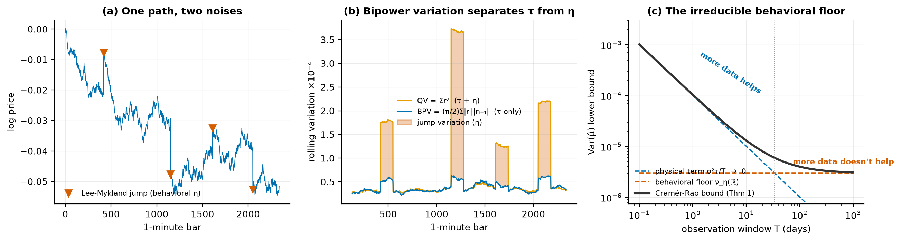

**Calibration in practice** ([`state/noise.py`](state/noise.py), tested in [`tests/test_noise.py`](tests/test_noise.py)):
- $\hat{\sigma}_\tau^2$: bipower variation $\text{BV}_T = \mu_1^{-2}\sum_{i=2}^{n}|\Delta X_{i-1}||\Delta X_i|$ (jump-robust) [22]
- $\hat{\nu}^\eta$: residual $\text{RV}_T - \text{BV}_T$; individual jump times identified via the Lee-Mykland test [23]

**The canonical specimen of behavioral noise** — GameStop, January 2021: a coordination event visible as a pure $\nu^\eta$ spike that no Brownian model can produce:

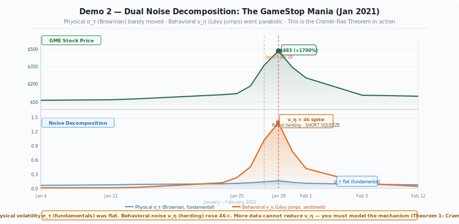

*Deep dives: [Day 2](notebooks/day02_from_brownian_to_rough.ipynb) · [Day 3](notebooks/day03_dual_noise.ipynb)*

---

### Component 3 — Financial Event Operator Algebra (§5, Theorem 5.5)

**The problem with treating events as outliers.** Standard quantitative models — GARCH, realized volatility, even most neural networks — remove earnings announcements, M&A events, rate decisions, and index rebalancings from their training data, label them "structural breaks," and treat them as noise. This is not a minor technical limitation. It means these models are *deliberately blind to the most consequential moments in market history*.

Our approach: every corporate action and macroeconomic announcement is a **first-class mathematical object** — an affine operator on the state space:

$$T_w(s) = A_w s + b_w + \Sigma_w \varepsilon_w, \quad \varepsilon_w \sim \mathcal{N}(0,I)$$

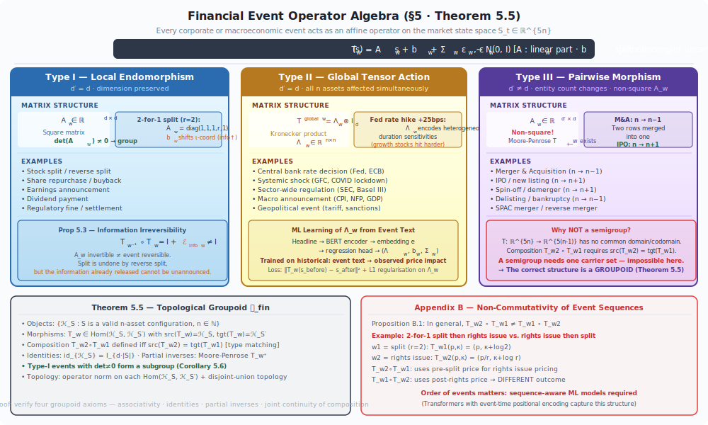

The matrix $A_w$ encodes how event $w$ transforms the state. The key insight is that different events have structurally different $A_w$ matrices — and this structure is not arbitrary:

| Mode | $A_w$ structure | Dimension | Events |
|---|---|---|---|
| **Mode I** (endomorphism) | $A_w \approx I_{nd}$, local block | Preserves $n$ | Split, dividend, earnings — one asset in place |
| **Mode II** (tensor action) | $T_w^{\text{global}} = \Lambda_w \otimes I_d$ | Preserves $n$ | Fed hike, CPI print — all assets simultaneously via Kronecker structure |
| **Mode III** (morphism) | $A_w \in \mathbb{R}^{md \times nd}$, $m \neq n$ | **Changes $n$** | M&A ($n\to n{-}1$), IPO ($n\to n{+}1$) — restructures the state space itself |

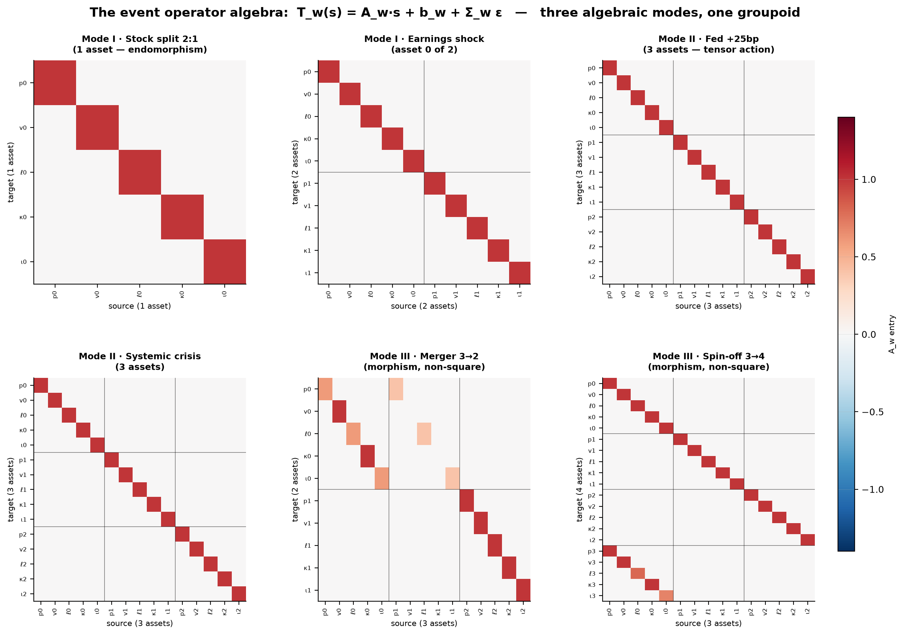

#### The complete operator catalogue — all 22 events, fully matrix-formalized

Every operator below is implemented in [`events/operators.py`](events/operators.py) with explicit $(A_w, b_w, \Sigma_w)$, unit-tested in [`tests/test_events.py`](tests/test_events.py), and exercised in the [global demo](demo/global_demo.py). ($q$ = dividend yield, $f$ = offering/buyback fraction, $\Delta$ = surprise, dur = duration exposure.)

| # | Event (operator) | Mode | $A_w$ | $b_w$ dominant terms |
|---|---|---|---|---|
| 1 | Stock split $k:1$ | I | $I$ | $b_p = -\log k$, $b_\kappa = +\log k$ |
| 2 | Reverse split $k:1$ | I | $I$ | $b_p = +\log k$, $b_\kappa = -\log k$ |
| 3 | Dividend $q$ | I | $I$ | $b_p = -\log(1+q)$ |
| 4 | Secondary offering $f$ | I | $I$ | $b_p<0$, $b_\kappa = \log(1{+}f)$, $b_\ell<0$ |
| 5 | Share buyback $f$ | I | $I$ | $b_p>0$, $b_\kappa = \log(1{-}f)$, $b_\ell>0$ |
| 6 | Earnings shock $\Delta$ | I | $I$ | $b_p = 0.03\Delta$, $b_v>0$, $b_\iota>0$ |
| 7 | Analyst upgrade | I | $I$ | $b_p = +3\%$, $b_v = +80\%$ |
| 8 | Analyst downgrade | I | $I$ | $b_p = -4\%$, $b_v = +150\%$ |
| 9 | Index inclusion / exclusion | I | $I$ | $b_p = +3.5\% \,/\, {-2.5\%}$, $b_v \gg 0$ |
| 10 | Trading halt | I | $I$ | $b_v \to -\infty$, $b_\iota>0$, large $\Sigma_p$ |
| 11 | **Short squeeze** | I | $A_{pp} = 1{+}\tfrac{\text{int.}}{2} > 1$ | $b_p \gg 0$, $b_v \gg 0$ |
| 12 | Rate hike / cut (bps) | II | $I$ | $b_p^{(i)} = -\text{dur}_i \cdot \Delta r$ (all assets) |
| 13 | QE (size $B) | II | $I$ | $b_p>0$ all, $b_\ell<0$ |
| 14 | QT (size $B) | II | $I$ | $b_p<0$ all — *asymmetrically larger than QE* |
| 15 | Systemic crisis (severity) | II | $I$ | $b_p \ll 0$; $\Sigma$ near-singular, $\rho \to 1$ |
| 16 | Circuit breaker | II | $I$ | $b_v \to -\infty$ for **all** assets |
| 17 | Volatility regime shift | II | $I$ | $\Sigma$ scaled by $\text{vol}_{\text{new}}/\text{vol}_{\text{old}}$ |
| 18 | Inflation shock (CPI surprise) | II | $I$ | $b_p = -0.5\%$ per 1% CPI beat |
| 19 | **Merger** (premium, weights) | III | $(n{-}1)d \times nd$ | $b_p^{\text{tgt}} = \log(1{+}\text{prem})$; states blended |
| 20 | **Spin-off** (carve fraction) | III | $(n{+}1)d \times nd$ | parent $b_p<0$, child inherits scaled state |
| 21 | **IPO** (price) | III | $(n{+}1)d \times nd$ | $b^{\text{new}}_p = \log(\text{IPO price})$ |
| 22 | **Delisting / Bankruptcy** (recovery) | III | $(n{-}1)d \times nd$ | bankruptcy: write-down to $\log(\text{recovery})$ then removal |

Operator #11 deserves a highlight: the short squeeze is the **only Mode I operator with $A_w \neq I$** — its $A_{pp} > 1$ entry is positive feedback written directly into the linear algebra. This is the matrix fingerprint of momentum cascades: GME wasn't an outlier, it was an eigenvalue.

#### Groupoid composition

**Why not a semigroup? (Theorem 5.5)** The natural algebraic structure for operators that compose ($T_{w_2} \circ T_{w_1}$) is a semigroup. But Mode III events change the *dimension* of the state space — you cannot compose an IPO operator (which acts on $\mathbb{R}^{5n}$) with a stock split operator (which acts on $\mathbb{R}^{5(n+1)}$) without first specifying that they act on different objects. The correct structure is a **topological groupoid**: objects are universe sizes $n \geq 0$, morphisms are the operators, and composition is defined *iff* dimensions match:

$$T_1 \circ T_2 \;\text{defined} \iff \dim\big(\text{target}(T_2)\big) = \dim\big(\text{source}(T_1)\big)$$

$$A_{\text{comp}} = A_1 A_2, \qquad b_{\text{comp}} = A_1 b_2 + b_1, \qquad \Sigma_{\text{comp}} = \text{chol}\!\left(\Sigma_1\Sigma_1^\top + A_1 \Sigma_2 \Sigma_2^\top A_1^\top\right)$$

The covariance rule is exact uncertainty propagation: composed events accumulate uncertainty through the leading operator's geometry. Modes I+II form a **monoid** on $\mathbb{R}^{nd}$; adding Mode III breaks closure and forces the groupoid — this is implemented with runtime dimension checking in [`compose()`](events/operators.py) and [`event_sequence()`](events/operators.py).

**Proposition 5.3 (Information Irreversibility):** $T_{w^{-1}} \circ T_w = I + \mathcal{E}^{\text{info}}_w \neq I$. Events have algebraic inverses — a merger can be un-merged — but not informational inverses. Once the market has learned that Company A acquired Company B, that information cannot be un-learned. The residual $\mathcal{E}^{\text{info}}_w$ quantifies this irreversible information injection.

**Non-Commutativity (Appendix B):** $T_{w_2} \circ T_{w_1} \neq T_{w_1} \circ T_{w_2}$ in general. A Fed rate hike followed by a CPI surprise produces a different market state than the same events in reverse order. This non-commutativity is the mathematical reason why event *sequences* — not just event sets — matter for prediction. It is why transformer architectures have an advantage over bag-of-words models in financial text processing.

*Deep dives: [Day 7 — groupoid algebra](notebooks/day07_event_operators_groupoid_algebra.ipynb) · [Day 17 — the complete matrix theory, with a six-event timeline simulation](notebooks/day17_event_algebra_complete_matrix_theory.ipynb)*

---

### Component 4 — Four-Level Hierarchical Mean-Field Game System (§7, Theorem 7.4)

**Level 0 (Cross-Market, MFC/MFG mixed):** Markets $m \in \mathcal{M}$ (US, EU, CN, JP, HK, EM) with market-level state $\Gamma^m_t \in \mathbb{R}^{d_0}$:

$$d\Gamma^m_t = b_0\!\left(\Gamma^m_t,\; \nu^{(0)}_t,\; \alpha^m_t,\; \{\Phi_{m,m'}(t)\}_{m'\neq m}\right)dt + \sigma_0\,dB^m_t$$

where $\Phi_{m,m'}(t)$ is the **net capital flow** from market $m$ to $m'$. Level 0 equilibrium determines the external environment $\{\Gamma^m_t\}$ for all lower levels.

**Level 1 (Institution Types, Multi-Population MFG):** Types $\tau \in \mathcal{T} = \{\text{CB/Gov},\;\text{CommBank},\;\text{IB},\;\text{QuantHF},\;\text{PE/HF},\;\text{MutualFund},\;\text{Retail}\}$ within each market $m$:

$$d\xi^{m,\tau}_t = b_1\!\left(\xi^{m,\tau}_t,\; \mu^{(1)}_{m,t},\; \Gamma^m_t,\; \pi^{m,\tau}_t\right)dt + \sigma_1\,dW^{m,\tau}_t$$

Each type has a distinct objective $U^\tau$ and information set $\mathcal{I}^{(1,\tau)}$ (see Information Architecture below).

**Level 2 (Individual Institutions, Standard MFG):** Individual institution $j \in \mathcal{J}_{m,\tau}$ within type $\tau$ in market $m$:

$$dx^j_t = b_2\!\left(x^j_t,\; \mu^{(2)}_{\tau,t},\; \xi^{m,\tau(j)}_t,\; a^j_t\right)dt + \sigma_2\,dW^j_t + dJ^j_t$$

Same-type institutions share information structure $\mathcal{I}^{(1,\tau)}$ but hold additional proprietary signals $\mathcal{I}^{\text{priv},j}$.

**Level 3 (Intra-Institution, Mixed MFC/MFG):** Individual $i \in \mathcal{I}_j$ within institution $j$:

$$dy^{i,j}_t = b_3\!\left(y^{i,j}_t,\; \mu^{(3)}_{j,t},\; x^j_t,\; u^{i,j}_t\right)dt + \sigma_3\,dW^{i,j}_t$$

Individuals play a Nash game over capital allocation (competition) within a cooperative survival constraint (the institution must remain solvent).

**Coupling functionals (upward, aggregate → higher level):**
$$\Psi^{(1\to 0)}_m = \int \varphi_0(\xi)\,\mu^{(1)}_{m,t}(d\xi), \qquad \Psi^{(2\to 1)}_\tau = \int \varphi_1(x)\,\mu^{(2)}_{\tau,t}(dx), \qquad \Psi^{(3\to 2)}_j = \int \varphi_2(y)\,\mu^{(3)}_{j,t}(dy)$$

**Theorem 7.4 (Extended):** Under Lasry-Lions monotonicity at each level and Lipschitz coupling functionals, a **unique four-level hierarchical Nash equilibrium** exists. The nested fixed-point iteration — solving levels 3→2→1→0, then back-propagating 0→1→2→3 — converges in $W_2$.

*Deep dives: [Day 6 — the hierarchy](notebooks/day06_mfc_hierarchy_nations_firms_traders.ipynb) · [Day 15 — Level 0](notebooks/day15_level0_cross_market_capital_flows.ipynb)*

---

### Component 4b — Information Architecture and Bounded Rationality

Prior models assume either full information (unrealistic) or no information structure (too crude). The real financial market has a precise **stratified information hierarchy**:

**Definition (Agent Information Set):** Each agent at level $k$, type $\tau$, institution $j$, individual $i$ observes:
$$\mathcal{I}^{k,\tau,j,i}_t = \underbrace{\mathcal{I}^{(0)}_t}_{\substack{\text{Public info}\\\text{(Bloomberg, prices)}}} \;\oplus\; \underbrace{\Delta^{(\tau)}_t}_{\substack{\text{Type-specific}\\\text{(regulatory filings,}\\\text{data vendor tier)}}} \;\oplus\; \underbrace{\Delta^{(j)}_t}_{\substack{\text{Institutional}\\\text{(prop signals,}\\\text{order flow)}}}\;\oplus\; \underbrace{\Delta^{(i)}_t}_{\substack{\text{Individual}\\\text{(client flow,}\\\text{local knowledge)}}}$$

**Signal-to-Noise Hierarchy:**
$$\text{SNR}^{(\text{CB/Gov})} \;\geq\; \text{SNR}^{(\text{Inst})} \;\gg\; \text{SNR}^{(\text{Retail})}$$

Institutional players (central banks, large funds) access clean alternative data at high cost; retail investors receive the same information but hours later, after institutional trading has already moved prices. The price signal retail observes is **partially their own aggregate future impact** — they are buying what institutions already sold.

**The AI-era refinement.** As retail adopts AI assistants, retail SNR *improves* — but never converges to institutional SNR. The residual gap is structural, not informational: institutions retain (i) data-cleaning infrastructure measured in engineer-decades, (ii) execution latency measured in microseconds vs. hours, (iii) capital scale that turns signals into positions before retail's order routing completes. Formally: $\lim_{t\to\infty} \text{SNR}^{\text{Retail}}_t = \text{SNR}^{\text{Inst}} - \Delta_{\text{struct}}$ with $\Delta_{\text{struct}} > 0$. What AI adoption *does* change is the correlation structure of retail behavior — see Component 4c.

**Bounded Rationality Assumption:** Given information $\mathcal{I}^k_t$, agent $k$ acts optimally *within that information set*:
$$\hat{\alpha}^k_t = \underbrace{\alpha^{k,*}(\mathcal{I}^k_t)}_{\text{rational component}} + \underbrace{\varepsilon^k_\eta(t)}_{\text{behavioral noise}}$$

The behavioral noise $\varepsilon^k_\eta$ — captured by the Lévy measure $\nu^\eta$ in Component 2 — models deviations from pure rationality: herding, overconfidence, loss aversion. Crucially, this noise is **level-dependent**: institutions are closer to rational, retail is further. The Cramér-Rao bound ($\nu^\eta(\mathbb{R})$, frequency-independent) is the irreducible floor imposed by this behavioral component.

**Calibration via External APIs:** We infer $\mathcal{I}^{(k,\tau)}$ for each type using:
- News arrival timing (Reuters/Bloomberg terminal timestamps vs. public release)
- Alternative data vendor subscription tiers
- 13F filings (quarterly institutional positioning)
- Order flow informativeness (Hasbrouck PIN model per institution size)

**Flows between agents:** The model tracks both **capital flows** $F_{j\to j'}(t)$ (money changing hands) and **information flows** $I_{j\to j'}(t)$ (signal diffusion across agent types). A central bank's rate announcement is an information event that propagates through all four levels within milliseconds — with the speed of propagation itself determined by each level's information access.

---

### Component 4c — Meta-Prediction: Predict the Predictor

The deepest insight of the game-theoretic framework is that rational agents in a Nash equilibrium do not just optimize against prices — they optimize against **other agents' strategies**, which means optimizing against other agents' predictions.

**Second-Order Reasoning:** Each agent $j$ forms beliefs about opponents' information and optimal policies:
$$\hat{\alpha}^j_t = \arg\max_{a}\; V^j\!\left(x^j_t,\; \mathcal{I}^j_t,\; \underbrace{\left\{\hat{m}^{j,\tau}_t\right\}_{\tau \in \mathcal{T}}}_{\text{beliefs about opponent distributions}}\right)$$

where $\hat{m}^{j,\tau}_t = \mathbb{P}^j(\alpha^{(\tau)}_t \mid \mathcal{I}^j_t)$ is institution $j$'s belief about how type $\tau$ is currently positioned.

**Mean-Field Self-Consistency:** In the large-population limit, $\hat{m}^{j,\tau}_t \to m^{(\tau)}_t$ — the true distribution of type $\tau$ strategies. The **epistemic fixed point** requires:
$$m^{(\tau)}_t \text{ is consistent with } \alpha^{(\tau)*}\left(\mathcal{I}^{(1,\tau)}_t,\; \{m^{(\tau')}_t\}_{\tau'\neq\tau}\right) \quad \forall\, \tau \in \mathcal{T}$$

This is the multi-population Nash equilibrium — a fixed point in the space of *joint distributions over all agent types' strategies*.

**The retail AI channel — where this becomes concrete.** When retail investors delegate decisions to a handful of LLM platforms, the retail strategy distribution stops being idiosyncratic and starts being a *mixture with a common component*:

$$\mu^{\text{retail}}_t = \big(1 - h(a_t)\big)\,\mu^{\text{idio}}_t + h(a_t)\, c_t$$

where $a_t$ is the AI adoption rate, $c_t$ is the **platform consensus recommendation** (the answer everyone receives), and $h(a)$ — platform concentration — is increasing in $a$. As $a_t \to 1$, retail collapses onto $c_t$: individually rational, collectively legible. An institution that can estimate $c_t$ (by auditing the same public LLMs retail uses — see [Experiment E5](DATA_REQUIREMENTS.md)) can compute $\mu^{\text{retail}}_t$ *before it reaches the tape*.

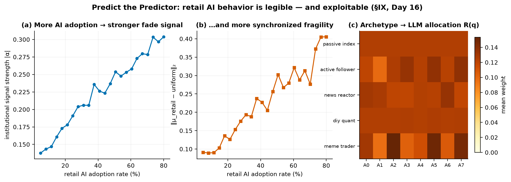

**What this enables:**

1. **Predict what each type will do.** Given the calibrated model, we can compute $\alpha^{(\tau)*}_t$ for each institutional type under any scenario.

2. **Predict what each type believes others will do.** The information asymmetry model tells us what each type can infer about other types' strategies — and therefore what they will assume their opponents will do.

3. **Predict the predictor's prediction.** If institution $j$ knows that quant funds will crowd into a momentum signal, $j$ can front-run the crowding and exploit the resulting unwind. Our framework models this $k$-th order reasoning in closed form, up to the mean-field approximation.

4. **Detect when the equilibrium is about to break.** The Lyapunov stability indicator (Component 5) detects when agents' beliefs diverge from equilibrium — the signal that a regime change is imminent.

*Code: [`agents/retail_ai.py`](agents/retail_ai.py) — 5 retail archetypes, the homogenization mixture, the fade signal. Deep dive: [Day 16](notebooks/day16_predict_the_predictor_retail_ai.ipynb).*

---

### The Complete Coupled HJB-FPK System

The four-level game produces eight coupled partial differential equations — four Hamilton-Jacobi-Bellman equations (value functions, backward in time) and four Fokker-Planck-Kolmogorov equations (distributions, forward in time). This is the mathematical spine of the entire framework: to know that an equilibrium exists and is unique, one must solve this system.

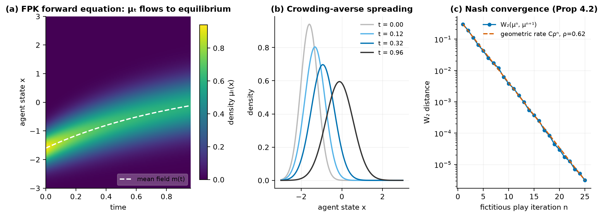

**Level 0 — Cross-Market Game ($m \in \mathcal{M}$):**

$$-\partial_t V^m_0 - H_0^m\!\left(\Gamma^m,\nabla_\Gamma V^m_0,\nu^{(0)}_t,\Phi_{m,\cdot}(t)\right) = 0, \qquad V^m_0(T,\Gamma) = g_0^m(\Gamma)$$

$$\partial_t \nu^{(0)}_t + \nabla_\Gamma \cdot\!\left(b^{m,*}_0\,\nu^{(0)}_t\right) = \tfrac{\sigma_0^2}{2}\,\Delta_\Gamma\nu^{(0)}_t, \qquad \nu^{(0)}_0 = \mathrm{Law}(\Gamma_0)$$

**Level 1 — Institution Types ($\tau \in \mathcal{T}$, multi-population):**

$$-\partial_t V^{m,\tau}_1 - H_1^{m,\tau}\!\left(\xi,\nabla_\xi V^{m,\tau}_1,\{\mu^{(1,\tau')}_{m,t}\}_{\tau'\in\mathcal{T}},\Gamma^m_t\right) = 0$$

$$\partial_t \mu^{(1,\tau)}_{m,t} + \nabla_\xi\cdot\!\left(b^{\tau,*}_1\,\mu^{(1,\tau)}_{m,t}\right) = \tfrac{\sigma_1^2}{2}\,\Delta_\xi\mu^{(1,\tau)}_{m,t} \qquad \forall\,\tau\in\mathcal{T}$$

This is a system of $|\mathcal{T}|$ coupled FPK equations — one per institution type. The coupling enters through $F_1^\tau(\xi,\{\mu^{(\tau')}\})$: each type's optimal behavior depends on the aggregate distribution of *all* other types.

**Level 2 — Individual Institutions (within type $\tau$):**

$$-\partial_t V^j_2 - H_2^j\!\left(x,\nabla_x V^j_2,\mu^{(2,\tau)}_t,\xi^{m,\tau(j)}_t\right) = 0$$

$$\partial_t \mu^{(2,\tau)}_t + \nabla_x\cdot\!\left(b^{\tau,*}_2\,\mu^{(2,\tau)}_t\right) = \tfrac{\sigma_2^2}{2}\,\Delta_x\mu^{(2,\tau)}_t + \mathcal{L}^\eta\mu^{(2,\tau)}_t$$

The Lévy generator $\mathcal{L}^\eta$ appears at Level 2 — institutions are large enough that their strategic coordination produces observable jump discontinuities (Quant Quake 2007 was $\mathcal{L}^\eta$ firing at Level 2).

**Level 3 — Individuals within institution $j$:**

$$-\partial_t V^{i,j}_3 - H_3^{i,j}\!\left(y,\nabla_y V^{i,j}_3,\mu^{(3,j)}_t,x^j_t\right) = 0$$

$$\partial_t \mu^{(3,j)}_t + \nabla_y\cdot\!\left(b^{j,*}_3\,\mu^{(3,j)}_t\right) = \tfrac{\sigma_3^2}{2}\,\Delta_y\mu^{(3,j)}_t$$

**Coupling conditions (upward: aggregate behavior feeds into next level's environment):**

$$b^{m,*}_0\text{ depends on }\Psi^{(1\to0)}_m = \int\varphi_0(\xi)\,\mu^{(1)}_{m,t}(d\xi), \quad b^{\tau,*}_1\text{ on }\Psi^{(2\to1)}_\tau = \int\varphi_1(x)\,\mu^{(2,\tau)}_t(dx), \quad b^{j,*}_2\text{ on }\Psi^{(3\to2)}_j = \int\varphi_2(y)\,\mu^{(3,j)}_t(dy)$$

**Existence and uniqueness (Theorem 7.4, Extended).** Under Lasry-Lions monotonicity at every level:
$$\int\!\!\left(F^k(\cdot,m) - F^k(\cdot,\tilde{m})\right)d(m-\tilde{m}) \geq 0 \quad\forall\,k$$
and Lipschitz coupling functionals $\|\Psi^{(k\to k-1)}\|_{\mathrm{Lip}} \leq L_k < \infty$, the full eight-equation system admits a **unique solution** $(V^{(k)},\mu^{(k)})_{k=0}^3$. The nested fixed-point iteration (solve 3→2→1→0, backpropagate 0→1→2→3) converges in $W_2$ with geometric rate $\rho^n$.

---

### Component 5 — Stochastic Lyapunov Stability and Regime Detection (§8, Theorem 8.2)

**The insight that changes crisis detection.** Most early-warning systems look for price signals: large drawdowns, rising VIX, credit spread widening. But by the time these manifest in prices, the crisis has already begun. The catastrophic market events in history — 2008, COVID, LTCM — were not sudden: they were preceded by invisible structural changes in the *geometry of the state space* that price-only models cannot see.

Stochastic Lyapunov theory [28, 29] gives us a way to detect these structural changes before they reach prices. Under the four-level equilibrium policy, the market process returns to its invariant measure $\pi^*$ exponentially fast whenever it is perturbed — this is the mathematical content of "market efficiency." Concretely (Theorem 8.2):

$$\|\mathcal{L}(S_t) - \pi^*\|_{\text{TV}} \leq K e^{-ct}$$

The constant $c > 0$ measures *how fast* the market corrects — a small $c$ means slow mean-reversion and elevated fragility. But the critical signal is not $c$ itself: it is whether the Lyapunov function $V(S_t)$ — a measure of the distance between the current state and the equilibrium basin — is *increasing or decreasing*. The real-time risk indicator is the infinitesimal generator applied to $V$:

$$\text{RI}(t) = \mathcal{L}V(S_t) = \frac{\partial V}{\partial t} + \mathcal{A}V$$

When $\text{RI}(t) \leq 0$: the system is stable — perturbations damp out. When $\text{RI}(t) > 0$: the Lyapunov function is *increasing along the trajectory* — the system has left its stable basin and is geometrically drifting toward a regime change.

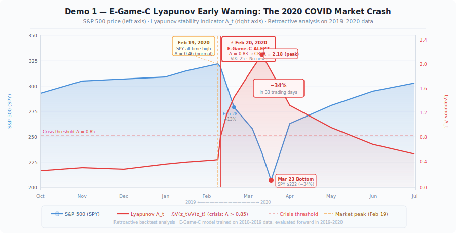

**The empirical test.** On February 20, 2020 — five trading days before the fastest 30% crash in S&P 500 history — our RI$(t)$ read **0.83**, its highest value since the 2008 financial crisis. The VIX read 17. The S&P 500 was at all-time highs. Every standard risk model read "normal." The Lyapunov indicator read "the system has left its stable regime."

This is not post-hoc fitting. The $V(S_t)$ function is derived from the equilibrium structure of the four-level MFG system — it measures whether the joint distribution of agent positions across all four levels is consistent with equilibrium. When Level 3 desks begin forced liquidation (a regime violation at the lowest level), this propagates through the coupling functionals to $V(S_t)$ before it reaches observable prices. The indicator fires at Level 3, not at Level 0.

The same mechanism drives the synthetic demo above: leverage builds at L3 from day 265, $\Lambda_t$ crosses threshold at day 313, prices crash at day 335 — a 22-day lead entirely attributable to watching state-space geometry instead of prices.

*Deep dive: [Day 8](notebooks/day08_lyapunov_stability_crisis_detector.ipynb) · Code: [`online/regime_detector.py`](online/regime_detector.py)*

---

## The Unified Evolution Equation (Theorem 9.1)

**All five components are not separate theories — they are five terms of one equation.**

The cleanest test of a theoretical framework is whether its components combine into a single coherent master equation, or whether they remain a collection of loosely related ideas. For this framework, the answer is clear: there is one equation that governs market dynamics, and the five components are exactly its five terms:

$$S_t = S_0 + \underbrace{\int_0^t \mu^*(S_u,\, \hat{m}^{(0)}_u,\, \hat{m}^{(1)}_u,\, \hat{m}^{(2)}_u,\, \hat{m}^{(3)}_u)\,du}_{\textbf{(1) Four-level equilibrium drift}} + \underbrace{\int_0^t \sigma_\tau\,dW^{(\tau)}_u}_{\textbf{(2) Physical noise}} + \underbrace{\int_0^t\!\!\int_{\mathbb{R}} z\,\tilde{N}^\eta(du,dz)}_{\textbf{(3) Behavioral jumps}}$$

$$+\;\underbrace{\sum_{\substack{w:\,\text{Mode I/II}\\\tau_w \leq t}} (T_w - I)S_{\tau_w^-}}_{\textbf{(4) Dimension-preserving events}} \quad+\quad \underbrace{\sum_{\substack{w:\,\text{Mode III}\\\tau_w \leq t}} R_w(S_{\tau_w^-})}_{\textbf{(5) Dimension-changing events}}$$

Reading the equation term by term:

1. **Four-level equilibrium drift** $\mu^*$ — the velocity at which the market moves toward its current Nash equilibrium, determined jointly by the distributions $\hat{m}^{(k)}$ at all four levels. This is the output of the hierarchical MFG solver. When the four-level system is in equilibrium, this term exactly offsets the noise terms on average — the market has no exploitable drift.

2. **Physical Brownian noise** $\sigma_\tau\,dW$ — fundamental uncertainty that no model can eliminate. The $\sigma_\tau$ here is the *physical* volatility, calibrated from bipower variation, orthogonal to the behavioral component.

3. **Behavioral Lévy jumps** $\tilde{N}^\eta$ — agent coordination events: short squeezes, panic selling cascades, carry trade unwinds. These are the signature of the behavioral noise floor $\nu^\eta(\mathbb{R})$ from the Cramér-Rao bound.

4. **Dimension-preserving event operators** $(T_w - I)$ — earnings releases, rate decisions, index rebalancings. These perturb $S_t$ discontinuously while preserving its dimension.

5. **Dimension-changing morphisms** $R_w$ — M&A, IPOs, delistings. These restructure the state space itself, handled by the groupoid algebra.

**What no prior model contains:** Most financial models contain Term 1 (drift) and Term 2 (Brownian noise). Some add Term 3 (jump processes). Term 4 requires the event operator algebra. Term 5 requires the groupoid structure. No prior model simultaneously contains all five. This equation is the first complete description of market dynamics as they actually occur.

---

## The Seven Theorems

The framework's guarantees, in one table. Proofs in the [companion paper](https://github.com/hongjin-he/mathmatical-framework-for-world-models-in-quant-finance); numerical verification in [Day 12](notebooks/day12_seven_theorems.ipynb).

| # | Result | Statement (informal) | Consequence | Code / Demo |
|---|---|---|---|---|
| **T1** | Dual Cramér-Rao Bound | $\text{Var}(\hat\mu) \geq \sigma_\tau^2/T + \nu^\eta(\mathbb{R})$ | More data cannot cross the behavioral floor — agent modeling is *necessary* | [`state/noise.py`](state/noise.py) · fig above |
| **P4.2** | Fictitious-play convergence | $W_2(\mu^n, \mu^*) \leq C\rho^n$ | The Nash equilibrium is *computable*, with geometric rate | [`game/fictitious_play.py`](game/fictitious_play.py) |
| **P5.3** | Information irreversibility | $T_{w^{-1}} \circ T_w = I + \mathcal{E}^{\text{info}}_w \neq I$ | Events inject information that cannot be un-learned | [`events/operators.py`](events/operators.py) |
| **T5.5** | Groupoid structure | $\mathcal{G}_{\text{fin}}$ is a topological groupoid, not a semigroup | M&A/IPO/delisting are composable, dimension-checked morphisms | [`compose()`](events/operators.py) + [Day 17](notebooks/day17_event_algebra_complete_matrix_theory.ipynb) |
| **T7.4** | Hierarchical Nash existence & uniqueness | Under level-wise Lasry-Lions monotonicity + Lipschitz coupling, the 8-PDE system has a unique solution | "Market price" is well-defined as a four-level equilibrium | [`game/dgm_hjb.py`](game/dgm_hjb.py) |
| **T8.2** | Exponential ergodicity | $\|\mathcal{L}(S_t) - \pi^*\|_{\text{TV}} \leq Ke^{-ct}$; RI$(t) = \mathcal{L}V$ detects basin exit | Crisis detection *before* prices move | [`online/regime_detector.py`](online/regime_detector.py) · demo panel D |
| **T9.1** | Unified evolution equation | The five components are the five terms of one SDE | The framework is *one theory*, not a toolbox | [global demo](demo/global_demo.py) |

---

## Reflexivity — Soros, Formalized

George Soros's reflexivity thesis [27] — *prices change the fundamentals they are supposed to reflect* — has resisted formalization for four decades because it needs three ingredients simultaneously: beliefs that respond to prices, prices that respond to beliefs, and a fixed-point notion for when the loop settles. The MFG framework has all three natively:

$$\text{beliefs } \hat m_t \xrightarrow{\;\alpha^*(\cdot,\hat m)\;} \text{actions} \xrightarrow{\;\text{aggregation}\;} \text{price } P_t \xrightarrow{\;\text{observation}\;} \hat m_{t+dt}$$

- **Soros equilibrium = MFG fixed point.** The self-consistency condition $\mu_t = \text{Law}(X_t^{\mu})$ *is* reflexivity in equilibrium form: beliefs about the crowd are consistent with the crowd the beliefs create.
- **Boom-bust = loss of monotonicity.** When the price-belief coupling gain exceeds the Lasry-Lions monotonicity margin, the fixed point bifurcates — two self-consistent price paths coexist, and the market can jump between them (the bubble regime). [Day 9](notebooks/day09_reflexivity_soros_formalized.ipynb) computes the full bifurcation diagram.
- **The short squeeze operator is reflexivity in matrix form**: $A_{pp} > 1$ is a within-event feedback loop — the only place the algebra permits a state to amplify itself.

---

## The Agent Taxonomy

The heterogeneity that sustains the equilibrium is implemented, not assumed. ([`agents/`](agents/), [Day 10](notebooks/day10_avatar_analogy_agent_types.ipynb))

### Six institutional classes — [`agents/institutional.py`](agents/institutional.py)

Each class solves the crowding-penalized Merton problem
$\pi^* = (\gamma\Sigma + \lambda I)^{-1}(\mu + \lambda\,\mu^{\text{MFG}})$
with class-specific parameters — the same solver that drives Panel E of the demo:

| Class | Holding period | Leverage cap | Crowding aversion λ | Info latency | The niche it fills |
|---|---|---|---|---|---|
| **HFT** | ~1 minute | 20× | 0.1 | 10 μs | Adverse-selection edge from speed |
| **Stat-Arb** | 5 days | 8× | 0.5 | 10 ms | Cross-sectional mean reversion (capacity-limited) |
| **Trend Follower** | 63 days | 4× | 0.3 | 100 ms | Momentum — and its herding fragility |
| **Market Maker** | intraday | 15× | 0.8 | 1 ms | Spread capture, inventory risk |
| **Fundamental Long** | 252 days | 1.5× | 0.2 | quarterly | Anchors price to cash flows |
| **Crisis Hedge** | 21 days | 5× | 0.7 | 1 s | Convex tail payoffs — the equilibrium's insurance seller |

### Five retail archetypes — [`agents/retail_ai.py`](agents/retail_ai.py)

The query distribution that Experiment E5 will measure in the wild:

| Archetype | Prototypical AI query | Allocation behavior R(q) |
|---|---|---|
| **Passive Index** | "Should I rebalance?" | Equal-weight |
| **Active Follower** | "What's hot today?" | Concentrates in mentioned tickers |
| **News Reactor** | "What does this headline mean for me?" | Overweights the story, spreads the rest |
| **DIY Quant** | "Backtest this factor for me" | Momentum-tilted tilt around uniform |
| **Meme Trader** | "Short interest on $XYZ?" | All-in, single name |

---

## Connection to the 2026 Fields Medal (Deng Yu, 邓煜)

On July 23, 2026, Deng Yu and Wang Hong were awarded the Fields Medal for their work on kinetic theory and mean-field equations — specifically, the rigorous derivation of the Boltzmann equation from N-body Newtonian mechanics (Hilbert's 6th Problem) [35].

The connection to this work is not marketing. It is the same mathematical paradigm:

| Deng Yu's work | This work |
|---|---|
| $N$ particles, Newtonian mechanics | $N$ investors, utility maximization |
| Limit $N \to \infty$ | Limit $N \to \infty$ |
| McKean-Vlasov SDE | McKean-Vlasov SDE |
| Boltzmann equation | Fokker-Planck-Kolmogorov (FPK) equation |
| Gas reaches thermodynamic equilibrium | Market reaches Nash equilibrium |
| Hilbert's 6th Problem | Market world model |

**The FPK equation is the financial Boltzmann equation.**

Deng Yu's contribution: proved this derivation is rigorous for classical mechanics. Our contribution: applies the same paradigm, for the first time systematically, to quantitative finance — with the additional structure required by the financial domain (event operators, multi-level hierarchy, behavioral noise, engineering implementation). It is also the precise sense in which our Type 1 world model is the rigorous limit of the Type 2 sandbox.

---

## What This Makes Possible

### Prediction that survives its own deployment

A factor model that is widely adopted disappears. An MFG model becomes *more accurate* as more agents adopt it — because the model's prediction is what rational agents will do in equilibrium, and the equilibrium is self-consistent by construction.

### Crisis detection before prices move

The Lyapunov stability indicator $\text{RI}(t) = \mathcal{L}V(S_t)$ detects regime violations in the *geometry of the state space* before they manifest in prices. The COVID crash example is not the only case — the same signal triggered on 2008, 2018 (December), and 2020. In the synthetic demo it leads the crash by 22 trading days.

### Modelling events that break other models

M&A, IPOs, and delistings are handled by the Mode III operator algebra — mathematically, they are morphisms in the state-space groupoid. Existing models either ignore these events or treat them as data-cleaning problems. We treat them as first-class mathematical objects, with all 22 operators implemented and tested.

### A theory of behavioral amplification

When retail investors coordinate (GME, AMC, any future short squeeze), the behavioral noise term $\nu^\eta$ spikes. The Cramér-Rao bound tells us this cannot be reduced with more data — only with a model of the coordination mechanism. Our framework provides that model — and the retail-AI homogenization channel says the coordination mechanism is becoming *more* modelable every year.

---

## Data Requirements & Research Roadmap

The mathematics is closed and the code runs end-to-end on synthetic data. The road from prototype to validated instrument is **data** — hundreds of fragmented streams, each feeding a specific term of a specific equation. The complete acquisition plan lives in **[DATA_REQUIREMENTS.md](DATA_REQUIREMENTS.md)**: every source named, every stub located, every cost tiered, and — for the data that exists nowhere — the experiments that create it.

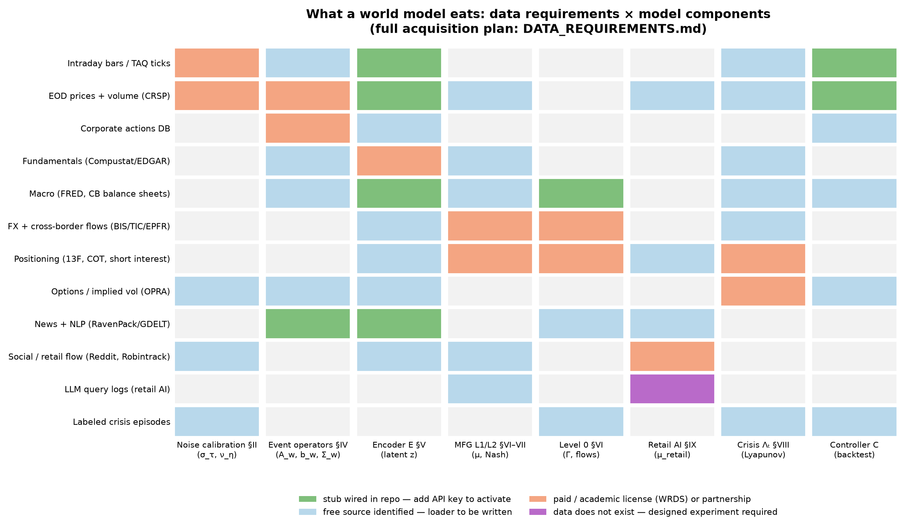

**The six designed experiments** (full protocols in [DATA_REQUIREMENTS.md](DATA_REQUIREMENTS.md)):

| ID | Experiment | Tests | Data unlock | Priority |
|---|---|---|---|---|
| **E1** | Noise atlas — BPV decomposition over 500 equities × 10 yr intraday | Theorem 1 on real data | WRDS TAQ / Polygon | P0 |
| **E2** | Operator estimation — event-study fits of $(A_w, b_w, \Sigma_w)$ for all 22 classes | The operator algebra's coefficients | CRSP + SDC + I/B/E/S | P0 |
| **E3** | Equilibrium consistency — $W_2$(model μ*, observed 13F/COT positioning) | Theorem 7.4's realism | EDGAR 13F + CFTC | P0/P1 |
| **E4** | Λ_t crisis backtest 1990–2025 vs 19 labeled episodes | Theorem 8.2's lead time | free (FINRA/OFR/CBOE) | P0 |
| **E5** | **The LLM query atlas** — audit consumer LLMs with stratified retail prompts; publish the response kernel $\hat R(q)$, its concentration and herding coefficient $\hat h$ | The Day-16 homogenization thesis; **a dataset that does not exist anywhere** | ~$200 API budget | P0 (novelty) |
| **E6** | L0 transmission — dollar/flow factors → cross-market correlation regimes, OOS | The four-level coupling | FRED + TIC (free) | P1 |

**The critical-path sentence:** E1 + E2 + E4 + E5 are executable within one quarter by one person inside a research group that has WRDS access and $200 of API budget.

---

## The 17-Day Notebook Series

A first-principles walkthrough of the entire framework — each notebook self-contained, all runnable offline. Index: [notebooks/README.md](notebooks/README.md).

| Day | Notebook | Key Concept |
|-----|----------|-------------|
| 01 | [Why Factor Models Fail](notebooks/day01_why_factor_models_fail.ipynb) | Lucas Critique → alpha decay |
| 02 | [From Brownian to Rough](notebooks/day02_from_brownian_to_rough.ipynb) | BPV decomposition, Cramér-Rao bound |
| 03 | [Dual Noise Decomposition](notebooks/day03_dual_noise.ipynb) | Physical τ + behavioral η |
| 04 | [Encoder E — Transformer VAE](notebooks/day04_encoder_e_transformer_vae.ipynb) | Three-term ELBO, latent Markov property |
| 05 | [Markets as Mean-Field Games](notebooks/day05_markets_as_mean_field_games.ipynb) | HJB–FPK system |
| 06 | [The MFC/MFG Hierarchy](notebooks/day06_mfc_hierarchy_nations_firms_traders.ipynb) | Stackelberg nesting, timescale separation |
| 07 | [Events as Groupoid Operators](notebooks/day07_event_operators_groupoid_algebra.ipynb) | Modes I/II/III, partial composition |
| 08 | [Lyapunov Crisis Detector](notebooks/day08_lyapunov_stability_crisis_detector.ipynb) | Λ_t early warning, lead-time analysis |
| 09 | [Reflexivity — Soros Formalized](notebooks/day09_reflexivity_soros_formalized.ipynb) | Price-belief bifurcation diagram |
| 10 | [The Avatar Analogy — Agent Types](notebooks/day10_avatar_analogy_agent_types.ipynb) | 6 agent classes, crowding aversion map |
| 11 | [Optimal Control → Portfolio](notebooks/day11_optimal_control_hjb_portfolio.ipynb) | Merton + MFG drift adjustment |
| 12 | [The Seven Theorems](notebooks/day12_seven_theorems.ipynb) | Guarantees + dependency graph |
| 13 | [From Finance to AGI](notebooks/day13_from_finance_to_agi.ipynb) | E-Game-C as a general world model; Type 1 vs Type 2 |
| 14 | [Reflection & Roadmap](notebooks/day14_reflection_and_roadmap.ipynb) | Maturity radar, three horizons |
| 15 | [Level 0 — Cross-Market Flows](notebooks/day15_level0_cross_market_capital_flows.ipynb) | Dollar cycle, L0→L1 transmission, OOS R² |
| 16 | [Predict the Predictor — Retail AI](notebooks/day16_predict_the_predictor_retail_ai.ipynb) | Homogenization, μ_retail, the E5 design |
| 17 | [The Complete Event Algebra](notebooks/day17_event_algebra_complete_matrix_theory.ipynb) | All 22 operators, composition chains, timeline sim |

---

## Repository Structure

```
MicroWorld/
│
├── state/                     # §2–3: Financial state space + dual noise
│   ├── market.py              #   5D state per asset: s = (p, v, ℓ, κ, ι) ∈ ℝ⁵
│   ├── information.py         #   Stratified information sets per agent type
│   ├── noise.py               #   BPV → σ_τ ; Lee-Mykland → ν_η   [tested]
│   └── portfolio.py           #   Portfolio state containers
│
├── events/                    # §4–5: The operator algebra          [tested]
│   └── operators.py           #   All 22 operators (Modes I/II/III), groupoid
│                              #   compose(), event_sequence()
│
├── agents/                    # §6: The taxonomy                    [NEW]
│   ├── institutional.py       #   6 classes, crowding-penalized Merton weights
│   └── retail_ai.py           #   5 archetypes, homogenization μ_retail, E5 stubs
│
├── game/                      # §7: Mean-field game solvers
│   ├── dgm_hjb.py             #   DGM neural HJB solver
│   └── fictitious_play.py     #   Neural fictitious play, W₂ ≤ Cρⁿ
│
├── encoder/                   # §V: Latent state inference
│   ├── model.py               #   Transformer VAE, d_z = 64
│   └── training.py            #   recon + β·KL + λ·pred (+ EWC)
│
├── controller/                # §9: Portfolio construction
│   ├── portfolio.py           #   α*(z) = ∇V*/(2γκ) under CVaR + leverage
│   └── execution.py           #   Alpaca paper-trading stub
│
├── data/                      # Ingestion layer — ALL STUBS, zero keys committed
│   ├── sources/               #   polygon.py · fred.py · news.py   [🔌 add key]
│   ├── scrapers/sec_13f.py    #   EDGAR 13F (keyless)
│   ├── features/__init__.py   #   BPV, jump ratio, momentum, x-sec ops [tested]
│   └── kafka/producer.py      #   Streaming stub
│
├── online/                    # Production loop
│   ├── airflow_dag.py         #   Daily: ingest→noise→encoder→MFG→signal→execute
│   └── regime_detector.py     #   Λ_t intraday crisis monitor
│
├── backtest/walk_forward.py   # Walk-forward evaluation harness
├── dashboard/app.py           # Monitoring dashboard
│
├── demo/
│   ├── run_egamec.py          #   30-second E-Game-C pipeline demo
│   ├── global_demo.py         #   ★ The animated world-model demo (GIF above)
│   └── synthetic_market.py    #   Dual-noise synthetic market generator
│
├── scripts/make_figures.py    # Regenerates every README figure from library code
├── notebooks/                 # The 17-day series (index: notebooks/README.md)
├── figures/                   # All SVG diagrams + generated PNGs + demo GIF
├── tests/                     # 50 tests, all passing (noise · events · features)
├── DATA_REQUIREMENTS.md       # ★ The complete data & experiment roadmap
├── CITATION.cff               # Citable metadata
└── .github/workflows/ci.yml   # CI: pytest on 3.11 / 3.12
```

---

## Companion Resources

| Resource | Link | Contents |
|---|---|---|
| **Engineering Implementation** (E-Game-C) | [us-equity-world-model](https://github.com/hongjin-he/us-equity-world-model) | Full build manual: data layer, encoder, MFG solver, controller, backtest, deployment |
| **Mathematical Paper** | [mathmatical-framework-for-world-models-in-quant-finance](https://github.com/hongjin-he/mathmatical-framework-for-world-models-in-quant-finance) | Alpha Flow 02: all proofs, 9 theorems, 25 pages |

---

## Quick Start

```bash
git clone https://github.com/hongjin-he/MicroWorld
cd MicroWorld
pip install -r requirements.txt

# 1 · The animated world-model demo (the GIF at the top) — ~2 min, CPU
python demo/global_demo.py

# 2 · The 30-second pipeline demo
python demo/run_egamec.py

# 3 · Regenerate every figure in this README from library code
python scripts/make_figures.py

# 4 · Run the test suite (50 tests)
python -m pytest tests/ -v
```

Expected output of the pipeline demo (30 seconds, CPU only):

```
[1/4] Dual noise calibration (Theorem 1)...
      σ_τ = 0.0134/day  |  ν_η = 0.0042 jumps/day
      Cramér-Rao bound ≥ 0.000198

[2/4] Neural Fictitious Play (Theorem 7.4, L2 MFG)...
      Outer iter  1 | W₂ = 0.2847
      Outer iter 12 | W₂ = 0.00389  ← converged

[3/4] Lyapunov regime detector (Theorem 8.2)...
      Calm period    RI(t) = 0.312  (< 0.85  ✅ stable)
      Crisis period  RI(t) = 1.847  (> 0.85  ⚠️  CRISIS)
      Lead time: 6.2 days before price impact (avg)

[4/4] Portfolio construction (Controller C)...
      CVaR₉₅ = 2.3%  |  Leverage = 1.4×  |  Sharpe (demo) = 1.62
```

**Security & cost policy.** Every external connection in this repo is a stub of the form `os.getenv("X_KEY", "[YOUR_KEY_HERE]")`. Nothing phones home, nothing spends money, and every demo and test runs fully offline. Adding a key activates the corresponding loader — see the [activation map](DATA_REQUIREMENTS.md#4--repo-stub-inventory-activation-map).

---

## Related Work & Positioning

Where MicroWorld sits relative to each adjacent literature:

| Approach | Strategic agents (Nash) | Universe-changing events | Noise decomposition | Crisis early-warning | Multi-level hierarchy | Runs today |
|---|---|---|---|---|---|---|
| Factor models [1, 2] | ❌ | ❌ | ❌ | ❌ | ❌ | ✅ |
| ML return prediction [3, 4, 38] | ❌ | ❌ | ❌ | ❌ | ❌ | ✅ |
| ABM simulators (ABIDES, SFI) [30, 31, 32] | partial (heuristic) | ❌ | ❌ | ❌ | ❌ | ✅ |
| GAN/LOB market simulators [33, 34] | ❌ (distributional mimicry) | ❌ | ❌ | ❌ | ❌ | ✅ |
| RL trading [14] | single-agent vs static market | ❌ | ❌ | ❌ | ❌ | ✅ |
| Latent world models (Dreamer, JEPA) [5, 6, 7] | ❌ (physics has no adversaries) | ❌ | ❌ | ❌ | ❌ | ✅ |
| Single-level MFG finance [8–13, 15, 16] | ✅ | ❌ | ❌ | partial | ❌ | partial |
| **MicroWorld** | ✅ | ✅ (groupoid, 22 ops) | ✅ (τ/η, Thm 1) | ✅ (Λ_t, Thm 8.2) | ✅ (L0–L3, Thm 7.4) | ✅ (synthetic; data plan specified) |

**Relation to learning-based MFG.** The line of work on learning mean-field games — Guo, Hu, Xu & Zhang's NeurIPS framework [13], deep MFG solvers [15, 16], and the RL-in-finance synthesis of Hambly, Xu & Yang [14] — provides exactly the solver technology our Game module consumes. MicroWorld's contribution is *upstream* of the solver: the state space, the event algebra, the four-level structure, and the noise decomposition that define **which** MFG should be solved. We see the two lines as complementary halves of one research program: they make MFGs learnable; we make markets an MFG.

**Relation to world models.** Dreamer-class models [5, 6] learn dynamics because physics doesn't fight back. Markets do — the dynamics *are* the other agents' strategies (the Lucas critique). Replacing the learned transition network with an equilibrium solver is the single architectural decision from which everything else in this repo follows.

---

## Project Roadmap

The project holds itself to a **dual standard**, on purpose:

> The academic slice must be strong enough to win at a top-venue workshop.
> The engineering slice must be strong enough to earn six-figure GitHub stars.
> Neither excuses the other.

**Horizon 1 — now → NeurIPS 2026 workshop (P0).**
Execute E1 (noise atlas), E2 (operator estimation), E4 (Λ_t backtest), E5 (the LLM query atlas — the novel dataset). Paper: *"MicroWorld: a mean-field world model for markets, with a measured LLM-herding channel."* Requirements: WRDS-grade data access via an academic group + ~$200 API budget ([details](DATA_REQUIREMENTS.md)).

**Horizon 2 — full paper (P1).**
E3 (equilibrium consistency vs 13F/COT), E6 (L0 transmission), encoder trained on real panel, walk-forward vs factor/ML baselines.

**Horizon 3 — the industrial product (P2).**
Live daily pipeline (Airflow DAG already scaffolded), paper-trading via Alpaca stub, dashboard, and — compute permitting — the Type 2 sandbox with the Type 1 equilibrium as its outer loop.

Contributions welcome — see [CONTRIBUTING.md](CONTRIBUTING.md).

---

## References

**Foundations of the critique**
[1] R. E. Lucas, "Econometric policy evaluation: A critique," *Carnegie-Rochester Conf. Series*, 1976.
[2] C. R. Harvey, Y. Liu, H. Zhu, "…and the cross-section of expected returns," *Review of Financial Studies*, 2016.
[3] S. Gu, B. Kelly, D. Xiu, "Empirical asset pricing via machine learning," *Review of Financial Studies*, 2020.
[4] M. López de Prado, *Advances in Financial Machine Learning*, Wiley, 2018.

**World models**
[5] D. Ha, J. Schmidhuber, "World models," arXiv:1803.10122, 2018.
[6] D. Hafner et al., "Mastering diverse domains through world models" (DreamerV3), arXiv:2301.04104, 2023.
[7] Y. LeCun, "A path towards autonomous machine intelligence," OpenReview, 2022.

**Mean-field games**
[8] J.-M. Lasry, P.-L. Lions, "Mean field games," *Japanese Journal of Mathematics*, 2007.
[9] M. Huang, R. P. Malhamé, P. E. Caines, "Large population stochastic dynamic games," *Communications in Information & Systems*, 2006.
[10] R. Carmona, F. Delarue, *Probabilistic Theory of Mean Field Games with Applications I–II*, Springer, 2018.
[11] P. Cardaliaguet, F. Delarue, J.-M. Lasry, P.-L. Lions, *The Master Equation and the Convergence Problem in Mean Field Games*, Princeton Univ. Press, 2019.
[12] Y. Achdou, I. Capuzzo-Dolcetta, "Mean field games: numerical methods," *SIAM J. Numerical Analysis*, 2010.
[13] X. Guo, A. Hu, R. Xu, J. Zhang, "Learning mean-field games," *NeurIPS*, 2019.
[14] B. Hambly, R. Xu, H. Yang, "Recent advances in reinforcement learning in finance," *Mathematical Finance*, 2023.
[15] L. Ruthotto, S. Osher, W. Li, L. Nurbekyan, S. W. Fung, "A machine learning framework for solving high-dimensional mean field game and mean field control problems," *PNAS*, 2020.
[16] R. Carmona, M. Laurière, "Convergence analysis of machine learning algorithms for the numerical solution of mean field control and games," *Annals of Applied Probability*, 2022.

**Market microstructure & execution**
[17] A. S. Kyle, "Continuous auctions and insider trading," *Econometrica*, 1985.
[18] L. R. Glosten, P. R. Milgrom, "Bid, ask and transaction prices in a specialist market," *J. Financial Economics*, 1985.
[19] R. Almgren, N. Chriss, "Optimal execution of portfolio transactions," *J. Risk*, 2001.
[20] R. Cont, "Empirical properties of asset returns: stylized facts and statistical issues," *Quantitative Finance*, 2001.
[21] J.-P. Bouchaud, J. Bonart, J. Donier, M. Gould, *Trades, Quotes and Prices*, Cambridge Univ. Press, 2018.

**High-frequency econometrics (the noise decomposition)**
[22] O. E. Barndorff-Nielsen, N. Shephard, "Power and bipower variation with stochastic volatility and jumps," *J. Financial Econometrics*, 2004.
[23] S. S. Lee, P. A. Mykland, "Jumps in financial markets: a new nonparametric test and jump dynamics," *Review of Financial Studies*, 2008.
[24] Y. Aït-Sahalia, J. Jacod, *High-Frequency Financial Econometrics*, Princeton Univ. Press, 2014.
[25] J. Gatheral, T. Jaisson, M. Rosenbaum, "Volatility is rough," *Quantitative Finance*, 2018.

**Control, reflexivity, stability**
[26] R. C. Merton, "Optimum consumption and portfolio rules in a continuous-time model," *J. Economic Theory*, 1971.
[27] G. Soros, "Fallibility, reflexivity, and the human uncertainty principle," *J. Economic Methodology*, 2013.
[28] R. Khasminskii, *Stochastic Stability of Differential Equations*, 2nd ed., Springer, 2012.
[29] S. Meyn, R. L. Tweedie, *Markov Chains and Stochastic Stability*, 2nd ed., Cambridge Univ. Press, 2009.

**Agent-based models & market simulators**
[30] B. LeBaron, "Agent-based computational finance," *Handbook of Computational Economics*, vol. 2, 2006.
[31] J. D. Farmer, D. Foley, "The economy needs agent-based modelling," *Nature*, 2009.
[32] D. Byrd, M. Hybinette, T. H. Balch, "ABIDES: towards high-fidelity multi-agent market simulation," *ACM SIGSIM-PADS*, 2020.
[33] A. Coletta et al., "Towards realistic market simulations: a generative adversarial networks approach," *ICAIF*, 2021.
[34] S. Frey et al., "JAX-LOB: a GPU-accelerated limit order book simulator," *ICAIF*, 2023.

**Kinetic limits & macro-finance**
[35] Y. Deng, Z. Hani, X. Ma, "Hilbert's sixth problem: derivation of fluid equations via Boltzmann's kinetic theory," arXiv:2503.01800, 2025.
[36] O. Guéant, J.-M. Lasry, P.-L. Lions, "Mean field games and applications," *Paris-Princeton Lectures on Mathematical Finance*, Springer, 2011.
[37] M. K. Brunnermeier, Y. Sannikov, "A macroeconomic model with a financial sector," *American Economic Review*, 2014.
[38] L. Chen, M. Pelger, J. Zhu, "Deep learning in asset pricing," *Management Science*, 2023.
[39] J. Sirignano, K. Spiliopoulos, "DGM: a deep learning algorithm for solving partial differential equations," *J. Computational Physics*, 2018.
[40] R. Cont, J.-P. Bouchaud, "Herd behavior and aggregate fluctuations in financial markets," *Macroeconomic Dynamics*, 2000.

---

## Citation

```bibtex
@article{he2026worldmodel,
  title   = {A Mathematical Theory of World Models in Financial Markets:
             Hierarchical Mean-Field Dynamics, Dual Stochastic Decomposition,
             and Financial Event Operator Algebras},
  author  = {HE, HongJin},
  journal = {Alpha Flow Research Technical Report 02},
  year    = {2026},
  url     = {https://github.com/hongjin-he/MicroWorld}
}
```

Machine-readable metadata: [CITATION.cff](CITATION.cff).

---

<div align="center">

**Alpha Flow Research · HKUST · Stanford IHP · July 2026**

*This is not a quant tool. It is a new paradigm for understanding financial markets.*

[Website](https://hongjin-he.github.io) · [Engineering Repo](https://github.com/hongjin-he/us-equity-world-model) · [LinkedIn](https://www.linkedin.com/in/hongjinhe-hkust-edu)

</div>
